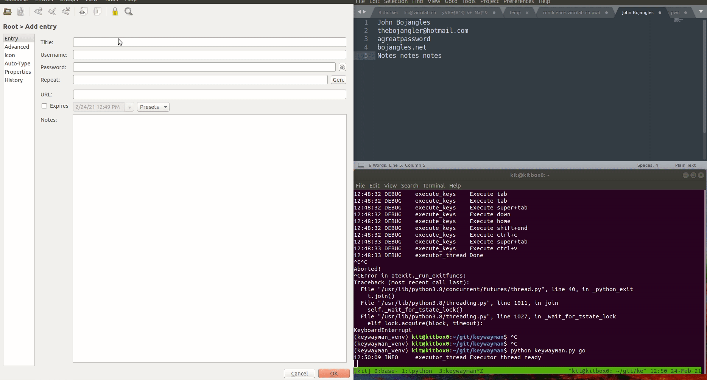

# keywayman
A highwayman for keystrokes. You can trigger sequences of keystrokes of arbitrary length to execute.

## Keystroke routines

Some defaults are found in keystrokes_default.yaml. 

The delays are present currently because when a keystroke has a modifier, I don't know how to gracefully check that the keystroke has finished successfully

## Todos

See todo.md